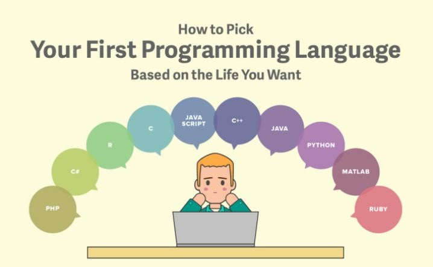

When I work on large group projects, I always find that the most difficult part to be team cohesion. Many times team members will begin working on a project by splitting it into pieces and dividing the work. They each will be working on parts of a project and then when they put their pieces together, more often than not, the pieces won't fit! I've run into this phenomenon many times, and it is for that reason, that I have come to appreciate the configuration management system.

To me, the logic remains the same in all programming languages, and the only notable difference is the syntax. Thanks to this, I have been able to transition from C++ into Javascript rather smoothly. The major difference I’ve noticed is that instead of specifying datatypes for variables like in C++ or Java, you only need to declare that it is, in fact, a variable. This difference makes it much easier to write basic programs, but I see problems in the future that involve integers being treated as decimal numbers.

Regarding the WOD method of teaching us Javascript, I have always loved the idea of turning study and work into games.  People tend to treat work as just that, and often get bored and uninterested in learning as a result. However, if one treats these tasks as a game, challenging themselves to complete it in a certain time limit, the task ceases to be work, and can actually be fun. I feel that these WOD challenges have been a great help in getting me to learn Javascript and to get better at it.     

