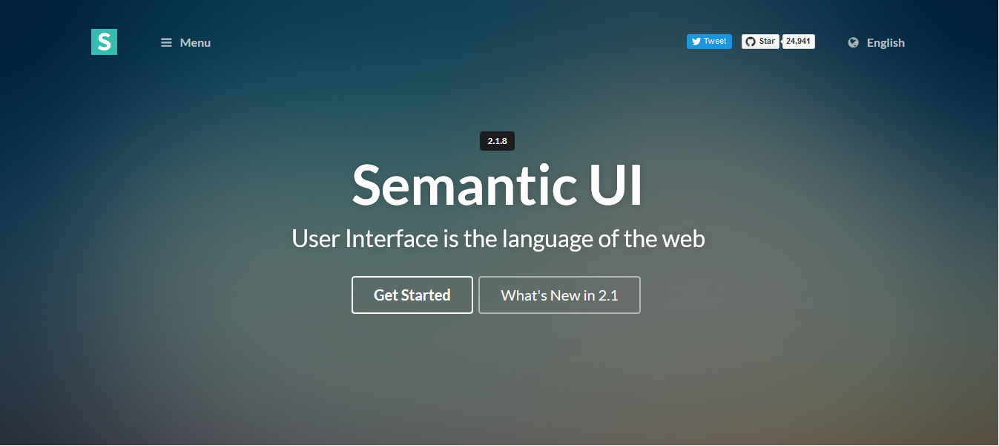

This week in Software Engineering, the amazing, the simple, the annoying Semantic UI module. After watching just one video introduction about Semantic UI, I knew that "this" would be the module to break me.. I knew that this "easy and intuitive" web design tool would be anything but. And of course, as if by some self-fulfilling prophecy, I ended up struggling long and hard to complete this week's WOD quiz, barely even finishing before that dreaded "DNF" mark.

Semantic UI, from my experience, can be such a pain to incorporate into pre-existing code; Code where I have already specified intricate details like image width, margins, or background colors, and know exactly what it does. When incorporating Semantic UI, suddenly, things become twisted distortions of their former selves. Icons end up in places they should not be in, backgrounds appear to bleed into UI grids, and columns of text become terribly misaligned. Semantic UI appears to use pre-existing class definitions to make organization easier and quicker. Yet, I can never be certain about what these classes exactly do. "small grey icon" maybe different from the small grey icon I have in my mind. 

In conclusion, I think Semantic UI can be okay if either the entire html page is implemented using its formats, or if only a small piece of it is needed. However, if you find yourself trying to incorporate say, an entire menu bar in the middle of your page, you may also find yourself debugging errors for a good hour thereafter. It is not as intuitive as it claims to be(in my opinion), but perhaps I am just ignorant. Perhaps, this little tool is more useful than I think. Only time will tell..