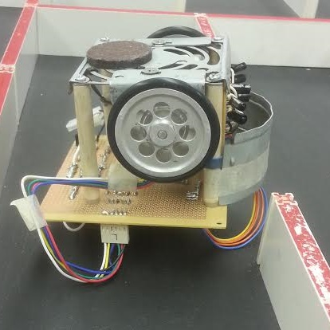

  
  
  
  

Micromouse is an international event where small robot “mice” compete to reach the center of a 16 x 16 maze in the fastest time possible.  Here at UH Manoa, we hold our own competition amongst the Electrical Engineering/Computer Engineering students every semester. The mice are built almost entirely from scratch by each team of students, which means that performance can vary heavily between mice. Mice can be classified based on sensor placement and motor type. Side-sensor mice have sensors placed anywhere along the side of the mouse, in the front, or in the back. In contrast, top-down mice are typically bigger and have sensors that go above the mouse and face downwards. Regarding the motors, groups may choose to use DC motors or stepping motors. Each of these components comes with its own batch of strengths and weaknesses which must be considered before construction and design. The mice are to be programmed from scratch as well, making use of clever algorithms in order to reach the center completely unaided.

For this project, I was the lead programmer responsible for programming the various capabilities of the mouse.  Early in our development, before the chasis was finished, I worked to make sure the mouse could poll from its sensors accurately and frequently. The sensors ended up being quite difficult since our sensor readings would fluctuate after I attached everything together and because the sensors themselves sent out AC signals, but the microcontroller needed DC to work. Once that was done, I went on to making sure our mouse could move its motors using interrupts. From there, I implemented the right-wall-hugger and the left-wall-hugger algorithms so that the mouse could reach the center...and it did! 

Micromouse is a massive project; it tests a person's knowledge of both hardware and software. It also gives participants experience in group work, time management, and even budget management. Overall, I think that what I gained from this project was more valuble than the headaches it would cause. I think that anyone could benefit from taking on the micromouse challenge esspecially ICS and computer engineering students.

You can learn more at the [UH Micromouse Website](http://www-ee.eng.hawaii.edu/~mmouse/about.html).

