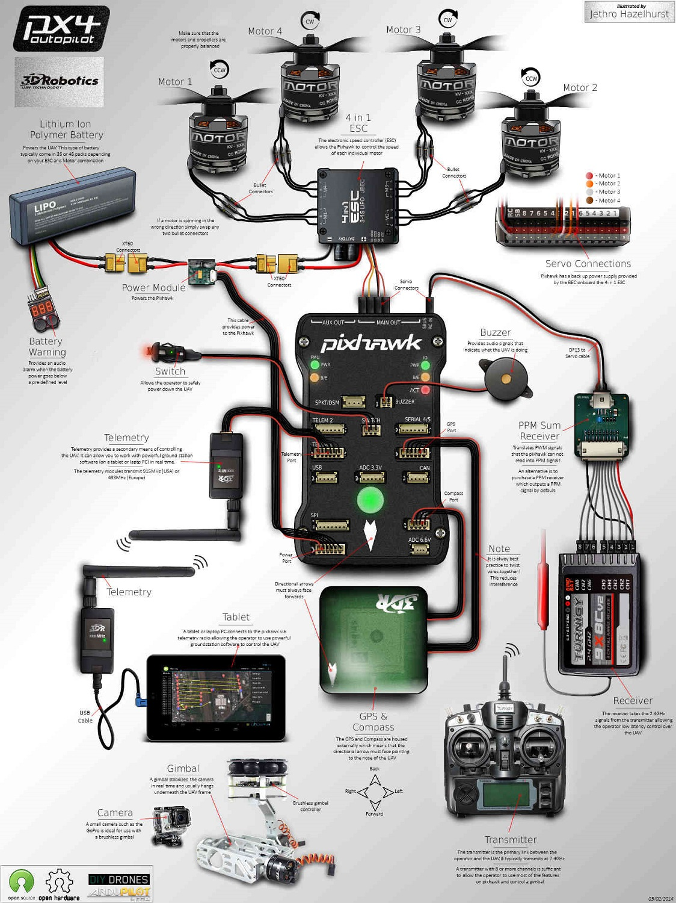

Aerial drones can be handy tools to have. Whether their purpose be taking that perfect in-air shot for a wedding, transporting goods, or monitoring hazardous enviornments; drones are quickly becoming tech favorites among owners. However, a problem with drones lies within the communication between the UAV and the controller. Data transfer between these two modules is not secure, and so this project aims to use encryption algorithms in order to secure the link between UAV and controller. 

For this project my team used [Ardupilot](https://github.com/ArduPilot/ardupilot) software on a [pixhawk](https://pixhawk.org/) unit to simulate a typical flight. Currently, we are working on implementing the encryption algorithms to encrypt communication to the pixhawk. 

This is an ongoing project, and while incomplete, the progress I have made so far in getting the controller and the pixhawk to communicate is nothing to be ashamed of. Through this project, I gained proficiency operating in a Linux environment, I got experience using git, and I learned about data excryption. 
